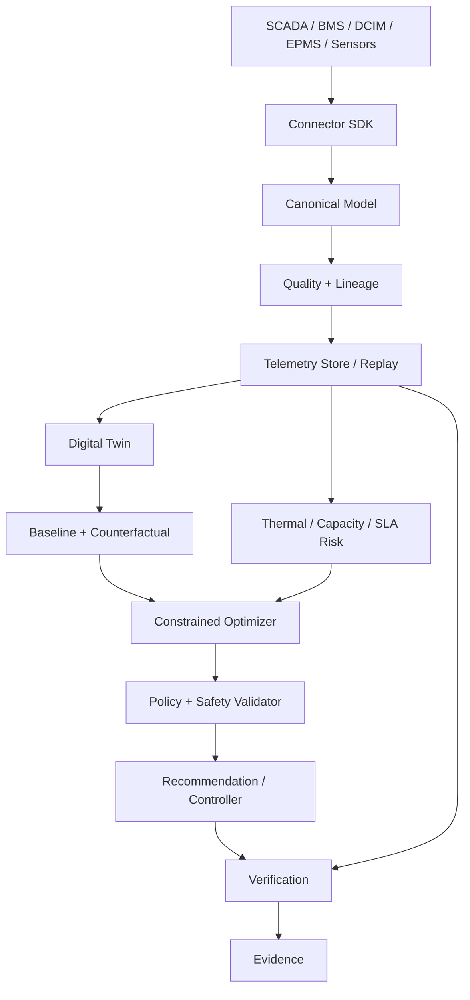

# DCOR Architecture

## 1. Architectural principles

1. **Canonical contract first.** Source telemetry is translated before domain use.
2. **Source independence.** Domain services never depend on vendor topics/registers/CSV columns.
3. **Digital-twin parity.** Live and replay/simulated telemetry use the same domain interfaces.
4. **Safety before actuation.** An optimizer proposes; policy validation authorizes.
5. **Evidence over claims.** Potential, predicted, executed and verified outcomes are distinct.
6. **Dynamic operating envelope.** Standards define reference/allowable envelopes; DCOR calculates the safe economic operating point for the current state.
7. **Risk is predictive.** Current measurements and trajectories/forecasts are both first-class inputs.
8. **Observable by default.** Quality, latency, lineage, uncertainty and policy decisions are recorded.

## 2. Logical architecture



## 3. Thermal-control architecture

DCOR treats temperature as one control variable in a coupled system:

```text
weather ─┐
load ────┼→ thermal state → cooling capacity → risk
humidity ┤                         ↑
setpoint ┘                         │
             control action ───────┘
```

For each candidate action, the optimizer evaluates:

- inlet/supply/return temperatures;
- relative humidity, wet-bulb and dew point where relevant;
- surface temperature and `DewPointMargin`;
- IT thermal load and density;
- cooling capacity and redundancy state;
- fan/pump/compressor operating point;
- workload/performance;
- weather forecast;
- SLA and equipment policies.

### State boundary

```text
SAFE → WATCH → MARGINAL → CRITICAL → UNSAFE
```

Transitions are driven by forecasted margins, not a single hardcoded temperature.

## 4. Setpoint semantics

DCOR explicitly separates three concepts:

```text
ASHRAE / OEM envelope
        ≠
facility control setpoint
        ≠
economic optimum
```

The 2021 ASHRAE H1 class addresses high-density air-cooled equipment with a narrower recommended range (18–22 °C) and allowable upper bound of 25 °C. This is an equipment/environment reference, not a universal DCOR setpoint. The applicable OEM, commissioning and facility policies may be stricter. citeturn0search1turn0search19

## 5. Dependency rule

```text
connectors → canonical-model
canonical-model → domain services
services → packages
apps → services/contracts
UI → API/canonical DTOs

FORBIDDEN:
UI → vendor connector
optimizer → raw source field
optimizer → vendor register/topic
optimizer → unvalidated measurement
```

## 6. Optimization boundary

The optimizer receives a canonical state and a policy set and returns candidate actions plus predicted consequences:

```text
State + Forecast + Baseline + Policies
                 ↓
             Optimizer
                 ↓
  candidate actions + prediction + uncertainty
                 ↓
          Safety/Policy Gate
             ↙       ↘
         reject       authorize
                         ↓
                  recommendation/control
```

No model can bypass the policy gate.

## 7. Risk model

A conceptual risk quantity is:

`R_thermal = P(unsafe thermal state | state, forecast, action)`

Required derived indicators:

- `ThermalMargin = T_limit - T_predicted`
- `DewPointMargin = T_surface - T_dewpoint`
- `CoolingCapacityMargin = Capacity_available - ThermalLoad`
- `TTU = min time until safe-set violation`
- `SLA_Risk = P(SLA violation)`

Risk implementations may be deterministic, probabilistic or learned, but their assumptions and uncertainty must be explicit.

## 8. Performance-aware objective

The product objective is not PUE minimization alone:

`maximize Useful_IT_Work / (Energy + λw Water + λc Carbon + λ$ Cost + λr Risk)`

subject to thermal, equipment, SLA, resilience and policy constraints.

This permits a setpoint increase only when the predicted resource benefit is not purchased by unacceptable IT-performance degradation or risk.

## 9. Verification and evidence

Every executed action must link:

`input state → policy version → action → predicted outcome → observed outcome → normalized baseline → verification decision`.

Only a measured, baseline-adjusted result can become `VERIFIED`.

## 10. Deployment evolution

1. local Python packages + fixtures;
2. containerized connectors/services;
3. event-driven ingestion + durable storage;
4. production fleet orchestration and governed control.

The canonical contract remains stable across deployment phases.
