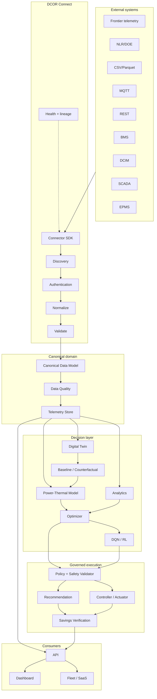
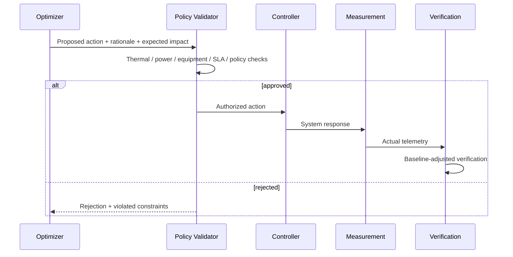

# DCOR Architecture

## 1. Architectural principles

1. **Canonical contract first.** Every source is translated before entering domain services.
2. **Source independence.** Optimization, analytics and UI depend on canonical contracts, never on vendor APIs.
3. **Digital-twin parity.** Real telemetry and simulated/replayed telemetry use the same domain interfaces.
4. **Safety before actuation.** AI can propose an action; policy validation decides whether it can reach a controller.
5. **Evidence over claims.** Potential, predicted and verified savings are distinct states.
6. **Independent components.** DCOR is the platform/product identity; connectors, twin, optimizers and applications can version independently.
7. **Observable by default.** Every ingestion and optimization path exposes health, quality, latency and lineage.
8. **No dashboard-first development.** Presentation is downstream of the canonical model.
9. **Power and thermal are coupled at high density.** 800 VDC distribution and liquid cooling are modeled as interoperable domains with a shared optimization boundary.

## 2. Logical architecture



## 3. Dependency rule

```text
connectors -> canonical-model
canonical-model -> domain services
services -> packages
apps -> services/contracts
UI -> API/canonical DTOs
power/thermal models -> canonical telemetry + topology contracts

FORBIDDEN:
UI -> vendor connector
optimizer -> raw CSV column name
optimizer -> MQTT topic
optimizer -> BMS-specific register
optimizer -> vendor-specific 800 VDC implementation
optimizer -> undocumented thermal assumptions
```

## 4. Connector contract

Every connector implements the same lifecycle:

- `connect()`
- `authenticate()`
- `discover()`
- `read()`
- `normalize()`
- `validate()`
- `health()`
- `disconnect()`

The SDK owns orchestration and error semantics. Adapters own source-specific protocol details.

## 5. Canonical data path

`source record → adapter → canonical telemetry → quality gate → lineage → storage → analytics/twin → optimization → policy → recommendation/control → verification`

A failed quality gate does not silently become a trusted measurement. Missing, duplicated, stale, impossible or unit-inconsistent data carries explicit quality metadata.

For MV1, electrical and thermal telemetry share the same canonical time/asset/lineage boundary so that power, workload and cooling scenarios can be replayed consistently.

## 6. Power-thermal architecture boundary

The detailed MV1 contract is defined in [`docs/POWER_THERMAL_800VDC.md`](docs/POWER_THERMAL_800VDC.md).

Reference high-density AI topology:

```text
MV / Grid
   ↓
AC→800 VDC conversion
   ↓
800 VDC distribution
   ↓
DC/DC + compute rack
   ↓
GPU/CPU
   ↓
Direct-to-chip liquid
   ↓
TCS / CDU
   ↓
Facility loop
   ↓
Dry cooler / Chiller / Optional evaporative assist
```

DCOR does **not** assume internal evaporative air cooling as the primary thermal path for high-density AI compute. Legacy air/evaporative regimes remain valid compatibility and historical benchmark cases.

800 VDC is likewise a modeled regime rather than a universal mandate. AC, hybrid sidecar and native/MV-to-800-VDC topologies must remain representable so that the optimizer can compare them under identical workload/environment assumptions.

## 7. Safety model



800 VDC and liquid-cooling actuation remains safety-critical. DCOR cannot autonomously bypass electrical protection/grounding/isolation rules or thermal flow/pressure/leak/interlock limits.

## 8. Savings states

- `POTENTIAL`: theoretical opportunity from current baseline.
- `PREDICTED`: model-estimated result before execution.
- `EXECUTED`: action was accepted and applied.
- `VERIFIED`: measured outcome after normalization against baseline, workload, weather and tariff/operational conditions.

Only `VERIFIED` savings are presented as realized savings.

## 9. Multi-tenant boundary

`Tenant → Facility → Asset hierarchy → Telemetry → Analytics/Twin → Optimization → Policies → Users/Roles`.

Tenant identifiers must be present in persisted domain records and enforced at service boundaries. Cross-tenant reads are denied by default.

## 10. Deployment evolution

Phase 1: local Python packages + fixtures.

Phase 2: containerized connector/telemetry services.

Phase 3: event-driven ingestion + durable telemetry storage.

Phase 4: production SaaS, fleet orchestration and controlled actuation.

The domain contract remains stable across phases.
