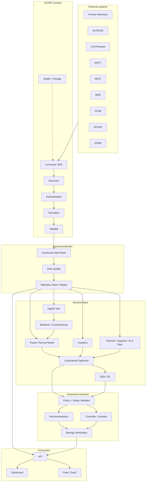

# DCOR Architecture

## 1. Architectural principles

1. **Canonical contract first.** Every source is translated before entering domain services.
2. **Source independence.** Optimization, analytics and UI depend on canonical contracts, never on vendor APIs.
3. **Digital-twin parity.** Real telemetry and simulated/replayed telemetry use the same domain interfaces.
4. **Safety before actuation.** AI can propose an action; policy validation decides whether it can reach a controller.
5. **Evidence over claims.** Potential, predicted, executed and verified savings are distinct states.
6. **Independent components.** DCOR is the platform/product identity; connectors, twin, optimizers and applications can version independently.
7. **Observable by default.** Every ingestion and optimization path exposes health, quality, latency and lineage.
8. **No dashboard-first development.** Presentation is downstream of the canonical model.
9. **Dynamic operating envelope.** Standards define reference/allowable envelopes; DCOR calculates the safe economic operating point for the current state.
10. **Predictive thermal risk.** Current measurements and trajectories/forecasts are first-class inputs.
11. **Power and thermal coupling.** At high density, electrical distribution, workload and cooling are evaluated across a shared time/asset/lineage boundary.

## 2. Logical architecture



## 3. Dependency rule

```text
connectors -> canonical-model
canonical-model -> domain services
services -> packages
apps -> services/contracts
UI -> API/canonical DTOs
power/thermal models -> canonical telemetry + topology contracts

FORBIDDEN:
UI -> vendor connector
optimizer -> raw CSV column name
optimizer -> MQTT topic
optimizer -> BMS-specific register
optimizer -> vendor-specific 800 VDC implementation
optimizer -> undocumented thermal assumptions
optimizer -> unvalidated measurement
```

## 4. Connector contract

Every connector implements the same lifecycle:

- `connect()`
- `authenticate()`
- `discover()`
- `read()`
- `normalize()`
- `validate()`
- `health()`
- `disconnect()`

The SDK owns orchestration and error semantics. Adapters own source-specific protocol details.

## 5. Canonical data path

`source record → adapter → canonical telemetry → quality gate → lineage → storage → analytics/twin/risk → optimization → policy → recommendation/control → verification`

A failed quality gate does not silently become a trusted measurement. Missing, duplicated, stale, impossible or unit-inconsistent data carries explicit quality metadata.

Electrical and thermal telemetry share the same canonical time/asset/lineage boundary so power, workload and cooling scenarios can be replayed consistently.

## 6. Thermal-control architecture

DCOR treats temperature as one control variable in a coupled system:

```text
weather ─┐
load ────┼→ thermal state → cooling capacity → risk
humidity ┤                         ↑
setpoint ┘                         │
             control action ───────┘
```

For each candidate action, the optimizer evaluates inlet/supply/return temperatures, humidity/dew point, surface temperature, IT load/density, cooling capacity/redundancy, fan/pump/compressor operating point, workload/performance, weather forecast and SLA/equipment policies.

State transitions are:

```text
SAFE → WATCH → MARGINAL → CRITICAL → UNSAFE
```

They are driven by forecasted margins and policy constraints, not a single hardcoded temperature.

## 7. Setpoint semantics

DCOR explicitly separates:

```text
ASHRAE / OEM envelope
        ≠
facility control setpoint
        ≠
optimizer candidate
        ≠
economic optimum
```

For high-density air-cooled equipment, the 2021 ASHRAE H1 reference uses an 18–22 °C recommended range and a 5–25 °C allowable dry-bulb range. It is an environmental reference, not a universal DCOR setpoint. OEM, commissioning and facility policies may be stricter.

## 8. Power-thermal architecture boundary

The detailed MV1 contract is defined in `docs/POWER_THERMAL_800VDC.md`.

```text
MV / Grid
   ↓
AC→800 VDC conversion
   ↓
800 VDC distribution
   ↓
DC/DC + compute rack
   ↓
GPU / CPU
   ↓
Direct-to-chip liquid
   ↓
TCS / CDU
   ↓
Facility loop
   ↓
Dry cooler / Chiller / Optional evaporative assist
```

DCOR does not assume internal evaporative air cooling as the primary thermal path for high-density AI compute. Legacy air/evaporative regimes remain valid compatibility and historical benchmark cases. 800 VDC is a modeled regime, not a universal mandate; AC, hybrid and native/MV-to-800-VDC topologies remain representable.

## 9. Optimization boundary and risk model

```text
State + Forecast + Baseline + Policies
                 ↓
             Optimizer
                 ↓
 candidate actions + prediction + uncertainty
                 ↓
          Safety/Policy Gate
             ↙       ↘
         reject       authorize
```

Conceptual thermal risk:

`R_thermal = P(unsafe thermal state | state, forecast, action)`

Required indicators:

- `ThermalMargin = T_limit - T_predicted`
- `DewPointMargin = T_surface - T_dewpoint`
- `CoolingCapacityMargin = Capacity_available - ThermalLoad`
- `TTU = min time until safe-set violation`
- `SLA_Risk = P(SLA violation)`

Risk implementations may be deterministic, probabilistic or learned, but assumptions and uncertainty must be explicit.

The product objective is:

`maximize Useful_IT_Work / (Energy + λw Water + λc Carbon + λ$ Cost + λr Risk)`

subject to thermal, equipment, SLA, resilience and policy constraints. PUE remains a KPI, not the sole objective.

## 10. Safety, verification and evidence

No model can bypass the policy gate. Every executed action must link:

`input state → policy version → action → predicted outcome → observed outcome → normalized baseline → verification decision`.

Only a measured, baseline-adjusted result can become `VERIFIED`.

For MV1, electrical protection, grounding, isolation, thermal flow/pressure, leak and interlock constraints remain behind the safety/policy boundary.

## 11. Savings states

- `POTENTIAL`: theoretical opportunity from current baseline.
- `PREDICTED`: model-estimated result before execution.
- `EXECUTED`: action was accepted and applied.
- `VERIFIED`: measured outcome after normalization against baseline, workload, weather and tariff/operational conditions.

Only `VERIFIED` savings are presented as realized savings.

## 12. Multi-tenant boundary

`Tenant → Facility → Asset hierarchy → Telemetry → Analytics/Twin → Optimization → Policies → Users/Roles`.

Tenant identifiers must be present in persisted domain records and enforced at service boundaries. Cross-tenant reads are denied by default.

## 13. Deployment evolution

1. local Python packages + fixtures;
2. containerized connector/telemetry services;
3. event-driven ingestion + durable telemetry storage;
4. production SaaS, fleet orchestration and governed control.

The canonical contract remains stable across deployment phases.
