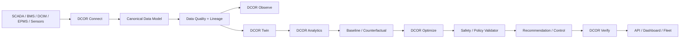

# DCOR — Data Center Optimization & Reduction


**Connect. Measure. Simulate. Optimize. Verify.**

**Open, vendor-neutral, polyglot by boundary, and test-gated by contract.**

DCOR is a platform for data-center energy, cooling, cost, carbon and operational optimization. **DCOR is the product/platform name; connectors, services and optimization engines are independently evolvable components.**

> **SCADA shows. DCIM organizes. BMS controls. DCOR explains, simulates, optimizes and verifies.**

## Project identity

### Otto — the DCOR mascot


**Otto is an otter because the animal maps naturally to DCOR's engineering problem:** intelligent use of water, agility in complex environments, interaction with infrastructure, and efficient adaptation. The mascot is deliberately technical rather than childish: Otto represents **efficiency, observability, cooling, resilience and controlled optimization**.

The brand rule is simple: **Otto observes before acting, optimizes within constraints, and verifies the result.**

## Product boundary

DCOR does not replace SCADA, BMS, DCIM or EPMS. It consumes their telemetry through connectors, converts heterogeneous data into a canonical contract, builds a digital-twin/counterfactual view, evaluates baselines, optimizes within safety and operational policies, and verifies realized savings.

The optimization layer is deliberately downstream of the data contract. **The dashboard is not the starting point.** UI components consume canonical data and must not encode vendor-specific telemetry assumptions.

## Architecture



## Polyglot engineering strategy

DCOR adopts the useful idea demonstrated by [PicoClaw](https://github.com/sipeed/picoclaw): **choose the language for the runtime boundary and deployment constraints, not for ideology**. PicoClaw uses a Go-native core and emphasizes portability, lightweight deployment and explicit architecture/documentation boundaries.

DCOR will therefore avoid a monolithic language mandate while keeping the canonical contracts language-neutral.

| Layer / workload | Preferred | Allowed alternatives | Rule |
|---|---|---|---|
| Canonical model / domain core | **Python** | Go, Rust | Keep contracts stable and language-neutral |
| Data connectors | **Python** | Go, Rust | Select by protocol, latency and deployment target |
| Edge / agent / low-memory runtime | **Go** | Rust, Python | Prefer static binaries and low operational overhead |
| High-performance protocol / device adapter | **Rust** | Go, C/C++ | Use only where profiling justifies it |
| Industrial / legacy device integration | **C/C++** | Rust, Python | Isolate behind Connector SDK boundary |
| Scientific modeling / research | **Python** | Julia | Reproducible experiments; production path exposes a stable contract |
| Optimization / ML | **Python** | Julia, Rust/C++ kernels | Keep models behind optimizer interfaces |
| API | **Python** | Go, Rust | Contract-first HTTP API |
| Web UI / dashboards | **TypeScript** | JavaScript | Consume canonical/API contracts only |
| Firmware / microcontrollers | **C/C++ / Rust** | — | Outside the core platform boundary |

### Language-selection rule

**Do not rewrite working Python into Go/Rust merely to increase language count.** Introduce another language only when it provides a measurable advantage in one or more of:

- memory footprint;
- startup time;
- deterministic execution;
- protocol/library availability;
- edge deployment;
- throughput/latency;
- safety or isolation;
- interoperability with existing infrastructure.

Every polyglot component must expose a stable DCOR contract and have contract/integration tests. The canonical telemetry model remains the interoperability boundary.

## Local development — one gate

The project intentionally keeps the initial dependency footprint small. A developer should not need a different recipe for every environment.

```sh
git clone https://github.com/scoobiii/dcor.git
cd dcor

./scripts/bootstrap.sh
./scripts/test.sh
```

Expected gate:

```text
DCOR local validation
=====================

Python ............... 3.x
Dependencies ......... OK
Canonical model ...... PASS
Connector SDK ........ PASS
Architecture ......... PASS
Tests ................ PASS
Coverage ............. PASS

DCOR LOCAL GATE: PASS
```

The same gate is used by CI. Current compatibility targets are documented in [docs/COMPATIBILITY.md](docs/COMPATIBILITY.md); development instructions are in [docs/DEVELOPMENT.md](docs/DEVELOPMENT.md).

## Delivery monitor

This table is the **living delivery contract**. Status changes only when the corresponding implementation, tests, CI validation and evidence exist. Detailed file-level tracking lives in [docs/DELIVERY_MANIFEST.md](docs/DELIVERY_MANIFEST.md).

| Sprint | Scope | Status | Exit evidence |
|---|---|---|---|
| S0 | Baseline, audit, reproducibility, CI + local gate | **IN PROGRESS** | reproducible local/CI gate |
| S1 | Clean Architecture + canonical contracts | **IN PROGRESS** | architecture + schema tests |
| S2 | Universal Connector SDK | **IN PROGRESS** | SDK + contract tests |
| S3 | Frontier connector | **PLANNED** | adapter + fixture + validation |
| S4 | NLR/DOE connector | **PLANNED** | adapter + fixture + validation |
| S5 | CSV/Parquet connector | **PLANNED** | ingestion + normalization tests |
| S6 | MQTT + REST connectors | **PLANNED** | protocol contract tests |
| S7 | Digital Twin + baseline | **PLANNED** | replay/counterfactual benchmark |
| S8 | Optimization engines | **PLANNED** | Rule/PID/MPC/MILP benchmarks |
| S9 | DQN / modern RL | **PLANNED** | reproducible RL benchmark |
| S10 | Savings verification + safety/control | **PLANNED** | verified savings + policy gates |
| S11 | SaaS, fleet, observability, production hardening | **PLANNED** | release gate + production checklist |

### Progress rule

`PLANNED → IN PROGRESS → CI VALIDATED → DONE`.

A sprint cannot become `DONE` merely because code was committed. The required files must exist, tests must pass, package coverage must meet **100%**, and the CI gate must validate the commit. LOC is monitored as engineering telemetry, **not as a quality or completion criterion**.

### Delivery completeness

DCOR is considered **fully delivered only when S0–S11 are DONE** and the final release gate confirms:

- all required repository artifacts are present;
- every sprint has its defined exit evidence;
- local gate passes;
- CI passes across the supported Python matrix;
- production package coverage is **100%**;
- compatibility claims are backed by executed environment validation;
- test and coverage artifacts are retained for audit/diagnosis where applicable.

## Commit/push protocol

- `feat(s0): establish dcor baseline and delivery contract`
- `feat(s1): define architecture and canonical model`
- `feat(s2): implement connector sdk`
- `feat(s3): add frontier connector`
- `feat(s4): add nlr doe connector`
- `feat(s5): add csv parquet connectors`
- `feat(s6): add mqtt rest connectors`
- `feat(s7): add digital twin and baseline`
- `feat(s8): add optimization engines`
- `feat(s9): add dqn and rl benchmark`
- `feat(s10): add verification and governed control`
- `feat(s11): production hardening and release gate`

Every push to `main` executes the CI test matrix and sprint delivery gate. Test and coverage outputs can be retained as workflow artifacts for diagnosis/audit.

## First canonical telemetry contract

The platform normalizes source-specific records into a stable envelope. Source lineage is preserved; the optimization domain does not depend on the source protocol.

```json
{
  "timestamp": "2026-09-04T15:00:00Z",
  "facility_id": "dc-001",
  "metric": "it_power_kw",
  "value": 842.3,
  "unit": "kW",
  "source": "example",
  "quality": "GOOD",
  "confidence": 1.0,
  "lineage": {"connector": "example", "record_id": "r-001"}
}
```

See [Canonical Data Model](docs/CANONICAL_DATA_MODEL.md).

## Connector roadmap

Priority implementation order:

1. Frontier telemetry
2. NLR/DOE PUE telemetry
3. CSV / Parquet
4. MQTT
5. REST
6. Additional BMS/DCIM/SCADA/EPMS adapters

The first five are adapters over the same Connector SDK and canonical contract.

## Research and optimization

The original Deep Q-Learning work is retained as research input rather than as the platform architecture. Optimization will be benchmarked in this order:

**baseline → rules → PID/MPC/MILP → DQN → Double/Dueling DQN → PPO/SAC**, with workload, thermal, equipment, SLA, cost, carbon and water constraints represented explicitly.

## Standards and governance

See [ARCHITECTURE.md](ARCHITECTURE.md), [STANDARDS.md](STANDARDS.md), [BACKLOG.md](BACKLOG.md), [docs/REUSE_MATRIX.md](docs/REUSE_MATRIX.md), and [docs/DELIVERY_MANIFEST.md](docs/DELIVERY_MANIFEST.md).

## Repository layout

```text
apps/                 deployable applications
services/             domain services
packages/             stable contracts and reusable libraries
connectors/           source/protocol adapters
digital-twin/         simulation and replay
datasets/             manifests/fixtures, not uncontrolled data dumps
research/             research adapters and experiments
hardware-lab/         physical/edge experiments
docs/                 architecture, standards, development and runbooks
benchmarks/           scientific comparisons
tests/                cross-component tests
infra/                deployment and operations
assets/               brand assets, including the DCOR mascot
.github/workflows/    CI gates
```

## Status

**Current gate: S0/S1/S2 foundation in progress.** The repository intentionally starts with the contract and ingestion layer. **Do not build the dashboard ahead of the canonical data model.**
