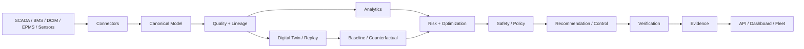

# DCOR — Data Center Optimization & Reduction


**English | [Português](docs/project/README.pt-br.md) | [Español](docs/project/README.es.md) | [Français](docs/project/README.fr.md) | [日本語](docs/project/README.ja.md) | [简体中文](docs/project/README.zh.md) | [한국어](docs/project/README.ko.md) | [Tiếng Việt](docs/project/README.vi.md) | [Bahasa Indonesia](docs/project/README.id.md) | [Italiano](docs/project/README.it.md)**

> **English is the canonical technical README. Localized snapshots are navigation aids and must not override the canonical contracts.**

**Connect. Measure. Simulate. Optimize. Verify.**

DCOR is a vendor-neutral platform for data-center energy, cooling, water, cost, carbon, performance and operational-risk optimization.

> **SCADA shows. BMS controls. DCIM organizes. DCOR explains, simulates, optimizes and verifies.**

## Core thesis

DCOR does not search for a universal temperature setpoint. It determines the **best safe operating point for the current state**.

The optimization question is:

> **What setpoint and control action maximize useful IT work per resource while preserving thermal, equipment, SLA and resilience margins?**

The optimizer must consider temperature, humidity, dew point, IT load, equipment density, cooling capacity, weather, workload, tariff, carbon, water, equipment wear and policy constraints.

## Thermal operating envelope

ASHRAE guidance is an **envelope/reference**, not a universal DCOR setpoint. The 2021 guidance introduced class H1 for high-density air-cooled servers, with a narrower recommended range of **18–22 °C** and allowable range of **15–25 °C**. General A-class guidance remains distinct. citeturn0search1turn0search19

Therefore DCOR must distinguish:

```text
STANDARD ENVELOPE != FACILITY SETPOINT != ECONOMIC OPTIMUM
```

A 22 °C baseline may be appropriate for a given facility/equipment class; it is not evidence that 22 °C is optimal for every operating state.

## Thermal risk

Thermal risk is modeled as a **forecasted probability of entering an unsafe state**, not simply `temperature > limit`.

Key margins:

- `ThermalMargin = T_limit - T_predicted`
- `DewPointMargin = T_surface - T_dewpoint`
- `CoolingCapacityMargin = Capacity_available - ThermalLoad`
- `SLA_Margin = SLA_target - SLA_risk`
- `TTU = TimeToUnsafeState`

DCOR uses the trajectory and forecast horizon to identify an unsafe transition before the boundary is crossed.

## Optimization objective

A canonical formulation is:

```text
maximize Useful_IT_Work(T, u) / ResourceCost(T, u)
```

with resource cost including energy, water, carbon, monetary cost and risk penalties, subject to:

```text
T_server <= T_limit
T_surface >= T_dewpoint + Δsafe
CoolingLoad <= CoolingCapacity
SLA_risk <= SLA_max
ThermalRisk <= Risk_max
Performance >= Performance_baseline
EquipmentPolicy == valid
```

The objective is intentionally multi-objective. **PUE remains an important KPI, but useful work per resource is the product-level objective.**

## What history teaches

### Google / DeepMind

Google reported up to **40% lower cooling energy** from machine-learning optimization in 2016; the later safety-first system used sensor snapshots, prediction, candidate actions and policy checks before control. This is the model for DCOR's `observe → predict → constrain → act → verify` loop. citeturn0search0turn0search3

### Prineville

The Facebook/Meta Prineville case demonstrates both high efficiency and the danger of control-induced psychrometric excursions. DCOR treats it as a resilience benchmark: weather → controls → humidity/dew point → equipment exposure → incident → corrective action.

Historical public figures such as the roughly 1.077 PUE reported for 2011 are **historical observations**, not current 2026 measurements. Missing current values must remain `unknown`, never estimated into a verified KPI.

### London extreme-weather case

Google's London 2022 cooling incident is a resilience case: extreme outdoor heat plus correlated failure of redundant cooling systems can defeat a seemingly redundant design. DCOR therefore models correlated cooling failure and controlled load shedding as explicit scenarios.

## Product proof path — MV0

```text
Source
 ↓
Canonical
 ↓
Quality + Lineage
 ↓
Replay
 ↓
Baseline
 ↓
Counterfactual
 ↓
Thermal / Performance Risk
 ↓
Optimization
 ↓
Safety / Policy
 ↓
Verification
 ↓
Evidence
```

See:

- [MV0](docs/MV0_FIRST_VERIFIABLE_OPTIMIZATION.md)
- [Thermal Optimization](docs/THERMAL_OPTIMIZATION.md)
- [Historical Cooling Cases](docs/HISTORICAL_COOLING_CASES.md)
- [Evidence Contract](docs/EVIDENCE_CONTRACT.md)
- [Replay](docs/REPLAY.md)
- [Benchmark](docs/BENCHMARK.md)

## Architecture



## Polyglot boundary

DCOR follows a contract-first polyglot strategy: Python for canonical/scientific work and API by default; Go/Rust where edge footprint, deterministic performance or protocol requirements justify them; TypeScript for UI; C/C++ or Rust for firmware/device boundaries. A language is introduced only when it provides measurable value.

## Development gate

```sh
git clone https://github.com/scoobiii/dcor.git
cd dcor
./scripts/bootstrap.sh
./scripts/test.sh
```

The machine gate, not LOC, determines delivery status.

## Delivery status

| Milestone | Status |
|---|---|
| S0 Foundation/audit/CI | IN PROGRESS |
| S1 Architecture/contracts | IN PROGRESS |
| S2 Connector SDK | IN PROGRESS |
| S3 Frontier | PLANNED |
| MV0 First Verifiable Optimization | PLANNED |
| S4–S11 | PLANNED |

See [BACKLOG.md](BACKLOG.md) and [docs/DELIVERY_MANIFEST.md](docs/DELIVERY_MANIFEST.md).

## Repository layout

```text
apps/ services/ packages/ connectors/
digital-twin/ datasets/ research/ hardware-lab/
docs/ benchmarks/ tests/ infra/ assets/
```

## Non-goals

- no universal fixed setpoint;
- no direct AI-to-actuator path;
- no verified-savings claim without measured evidence;
- no Uptime Institute certification claim;
- no RL before validated data, replay and non-RL baselines;
- no vendor-specific assumptions in the canonical domain model.
