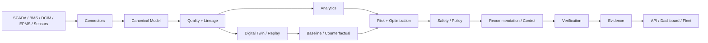

# DCOR — Data Center Optimization & Reduction


**English | [Português](docs/project/README.pt-br.md) | [Español](docs/project/README.es.md) | [Français](docs/project/README.fr.md) | [日本語](docs/project/README.ja.md) | [简体中文](docs/project/README.zh.md) | [한국어](docs/project/README.ko.md) | [Tiếng Việt](docs/project/README.vi.md) | [Bahasa Indonesia](docs/project/README.id.md) | [Italiano](docs/project/README.it.md)**

> **English is the canonical technical README. Localized snapshots are navigation aids and must not override the canonical contracts.**

**Connect. Measure. Simulate. Optimize. Verify.**

DCOR is a vendor-neutral platform for data-center energy, cooling, water, cost, carbon, performance and operational-risk optimization.

> **SCADA shows. BMS controls. DCIM organizes. DCOR explains, simulates, optimizes and verifies.**

## Project identity

### Otto — the DCOR mascot


**Otto is an otter because the animal maps naturally to DCOR's engineering problem:** intelligent use of water, agility in complex environments, interaction with infrastructure, and efficient adaptation. The mascot represents efficiency, observability, cooling, resilience and controlled optimization.

The brand rule is simple: **Otto observes before acting, optimizes within constraints, and verifies the result.** See [docs/OTTO_BRAND_SYSTEM.md](docs/OTTO_BRAND_SYSTEM.md).

## Product boundary

DCOR does not replace SCADA, BMS, DCIM or EPMS. It consumes telemetry through connectors, converts heterogeneous data into a canonical contract, builds a digital-twin/counterfactual view, evaluates baselines, optimizes within safety and operational policies, and verifies realized savings.

The dashboard is downstream of the canonical data model. UI components must not encode vendor-specific telemetry assumptions.

## Core thesis

DCOR does not search for a universal temperature setpoint. It determines the **best safe operating point for the current state**.

> **What setpoint and control action maximize useful IT work per resource while preserving thermal, equipment, SLA and resilience margins?**

The optimizer considers temperature, humidity, dew point, IT load, equipment density, cooling capacity, weather, workload, tariff, carbon, water, equipment wear and policy constraints.

## Thermal operating envelope

ASHRAE guidance is an **envelope/reference**, not a universal DCOR setpoint. For high-density air-cooled equipment, the 2021 ASHRAE H1 reference uses a narrower recommended range of **18–22 °C** and an allowable dry-bulb range of **5–25 °C**. The applicable OEM, commissioning and facility policies may be stricter.

DCOR therefore distinguishes:

```text
STANDARD / OEM ENVELOPE != FACILITY SETPOINT != OPTIMIZER CANDIDATE != ECONOMIC OPTIMUM
```

Temperature is not evaluated alone. Humidity, dew point, surface temperature, rate of change, load and cooling capacity are part of the thermal state.

See [docs/THERMAL_PATTERNS_ASHRAE.md](docs/THERMAL_PATTERNS_ASHRAE.md).

## Thermal risk

Thermal risk is modeled as a **forecasted probability of entering an unsafe state**, not simply `temperature > limit`.

Key indicators:

- `ThermalMargin = T_limit - T_predicted`
- `DewPointMargin = T_surface - T_dewpoint`
- `CoolingCapacityMargin = Capacity_available - ThermalLoad`
- `SLA_Risk = P(SLA violation)`
- `TTU = min time until safe-set violation`

The state machine is:

```text
SAFE → WATCH → MARGINAL → CRITICAL → UNSAFE
```

The optimizer uses trajectory and forecast horizon to identify unsafe transitions before the boundary is crossed.

## Optimization objective

```text
maximize Useful_IT_Work(T, u) / ResourceCost(T, u)
```

Resource cost includes energy, water, carbon, monetary cost and risk penalties, subject to:

```text
T_server <= T_limit
T_surface >= T_dewpoint + Δsafe
CoolingLoad <= CoolingCapacity
SLA_risk <= SLA_max
ThermalRisk <= Risk_max
Performance >= Performance_baseline
EquipmentPolicy == valid
```

**PUE remains an important KPI, but useful work per resource is the product-level objective.**

## Historical cooling benchmarks

DCOR uses historical public cases as **benchmarks and failure-mode references**, not as current operational measurements.

- **Google / DeepMind:** ML-based cooling optimization and the later safety-first control architecture motivate `observe → predict → constrain → act → verify`.
- **Prineville:** efficiency plus psychrometric/control-excursion risk; benchmark path is weather → controls → humidity/dew point → equipment exposure → incident → corrective action.
- **Google London 2022:** extreme-weather and correlated cooling-failure resilience scenario.
- **Oracle:** historical cooling/efficiency context where source data is available.

Historical PUE/WUE values retain their source date. Missing current values remain `unknown`; they are never promoted to verified current KPIs.

See [docs/HISTORICAL_COOLING_CASES.md](docs/HISTORICAL_COOLING_CASES.md) and [docs/BENCHMARK.md](docs/BENCHMARK.md).

## Product proof path — MV0

```text
Source
 ↓
Canonical
 ↓
Quality + Lineage
 ↓
Replay
 ↓
Baseline
 ↓
Counterfactual
 ↓
Thermal / Performance Risk
 ↓
Optimization
 ↓
Safety / Policy
 ↓
Verification
 ↓
Evidence
```

Contracts:

- [MV0 — First Verifiable Optimization](docs/MV0_FIRST_VERIFIABLE_OPTIMIZATION.md)
- [Thermal Optimization](docs/THERMAL_OPTIMIZATION.md)
- [ASHRAE Thermal Patterns](docs/THERMAL_PATTERNS_ASHRAE.md)
- [Historical Cooling Cases](docs/HISTORICAL_COOLING_CASES.md)
- [Evidence Contract](docs/EVIDENCE_CONTRACT.md)
- [Replay](docs/REPLAY.md)
- [Benchmark](docs/BENCHMARK.md)

Illustrative values are not product results. DCOR distinguishes `POTENTIAL`, `PREDICTED`, `EXECUTED` and `VERIFIED`; only verified results may be presented as realized savings.

## MV1 — 800 VDC + liquid cooling

The next product-value frontier is **MV1 — Power-Thermal Co-Optimization for high-density AI infrastructure**.

DCOR models 800 VDC distribution and direct-to-chip liquid cooling as an open, vendor-neutral optimization regime. Legacy AC/air/evaporative regimes remain representable for compatibility and historical benchmarking.

```text
MV / Grid
   ↓
AC→800 VDC conversion
   ↓
800 VDC distribution
   ↓
DC/DC + compute rack
   ↓
GPU / CPU
   ↓
Direct-to-chip liquid
   ↓
TCS / CDU
   ↓
Facility cooling loop
   ↓
Dry cooler / Chiller / Optional evaporative assist
```

The objective is coupled electrical + thermal optimization under workload, weather, cost, carbon, water, reliability, SLA and safety constraints. See [docs/POWER_THERMAL_800VDC.md](docs/POWER_THERMAL_800VDC.md).

## Architecture



See [ARCHITECTURE.md](ARCHITECTURE.md) for the normative architecture and safety boundary.

## Polyglot engineering strategy

DCOR uses a contract-first polyglot strategy: Python for canonical/scientific work and API by default; Go/Rust where edge footprint, deterministic performance or protocol requirements justify them; TypeScript for UI; C/C++ or Rust for firmware/device boundaries.

The rule is **not** to rewrite working Python merely to increase language count. Introduce another language only when it provides measurable value in memory footprint, startup time, deterministic execution, protocol availability, edge deployment, throughput/latency, safety/isolation or interoperability.

Every polyglot component exposes a stable DCOR contract and has contract/integration tests. The canonical telemetry model remains the interoperability boundary.

## Local development — one gate

```sh
git clone https://github.com/scoobiii/dcor.git
cd dcor
./scripts/bootstrap.sh
./scripts/test.sh
```

The machine gate, not LOC, determines delivery status.

## Delivery monitor

| Milestone | Scope | Status | Exit evidence |
|---|---|---|---|
| S0 | Baseline, audit, reproducibility, CI + local gate | **IN PROGRESS** | reproducible local/CI gate |
| S1 | Clean Architecture + canonical contracts | **IN PROGRESS** | architecture + schema tests |
| S2 | Universal Connector SDK | **IN PROGRESS** | SDK + contract tests |
| S3 | Frontier connector | **PLANNED** | adapter + fixture + validation |
| **MV0** | First Verifiable Optimization + thermal risk | **PLANNED** | baseline + counterfactual + risk + verification/evidence |
| **MV1** | 800 VDC + liquid cooling co-optimization | **PLANNED** | coupled topology + counterfactual + deterministic optimization + evidence |
| S4 | NLR/DOE connector | **PLANNED** | adapter + fixture + validation |
| S5 | CSV/Parquet connectors | **PLANNED** | ingestion + normalization tests |
| S6 | MQTT + REST connectors | **PLANNED** | protocol contract tests |
| S7 | Digital Twin + baseline | **PLANNED** | replay/counterfactual benchmark |
| S8 | Optimization engines | **PLANNED** | Rule/PID/MPC/MILP benchmarks |
| S9 | DQN / modern RL | **PLANNED** | reproducible RL benchmark |
| S10 | Savings verification + safety/control | **PLANNED** | verified savings + policy gates |
| S11 | SaaS, fleet, observability, production hardening | **PLANNED** | release gate + production checklist |

Status changes only when implementation, tests, CI validation and evidence exist. See [docs/DELIVERY_MANIFEST.md](docs/DELIVERY_MANIFEST.md).

## Engineering evidence

First-class delivery artifacts include replay, machine-readable evidence, common benchmarks, the MV1 power-thermal model and external-audit revalidation.

See [docs/SWOT.md](docs/SWOT.md) for the evidence-oriented product/engineering assessment and 1–2–3 maturity scale.

## Connector roadmap

1. Frontier telemetry
2. NLR/DOE PUE telemetry
3. CSV / Parquet
4. MQTT
5. REST
6. Additional BMS/DCIM/SCADA/EPMS adapters, subject to the Connector ROI Matrix

## Research and optimization

Optimization is benchmarked in this order:

**baseline → rules → PID/MPC/MILP → power-thermal co-optimization → DQN → Double/Dueling DQN → PPO/SAC**.

RL is not a substitute for validated data, replay, baselines or safety gates. Advanced RL follows the first verifiable product paths.

## Standards and governance

See [ARCHITECTURE.md](ARCHITECTURE.md), [STANDARDS.md](STANDARDS.md), [BACKLOG.md](BACKLOG.md), [docs/REUSE_MATRIX.md](docs/REUSE_MATRIX.md), [docs/DELIVERY_MANIFEST.md](docs/DELIVERY_MANIFEST.md), [docs/POWER_THERMAL_800VDC.md](docs/POWER_THERMAL_800VDC.md), [docs/SWOT.md](docs/SWOT.md), and [docs/AUDIT_REVALIDATION.md](docs/AUDIT_REVALIDATION.md).

## Repository layout

```text
apps/                 deployable applications
services/             domain services
packages/             stable contracts and reusable libraries
connectors/           source/protocol adapters
digital-twin/         simulation and replay
datasets/             manifests/fixtures, not uncontrolled data dumps
research/              research adapters and experiments
hardware-lab/         physical/edge experiments
docs/                 architecture, standards, product and runbooks
benchmarks/           scientific comparisons
tests/                cross-component tests
infra/                deployment and operations
assets/               brand assets, including the DCOR mascot
.github/workflows/    CI gates
```

## Non-goals

- no universal fixed setpoint;
- no direct AI-to-actuator path;
- no verified-savings claim without measured evidence;
- no Uptime Institute certification claim;
- no RL before validated data, replay and non-RL baselines;
- no vendor-specific assumptions in the canonical domain model;
- no assumption that 800 VDC is universally optimal;
- no assumption that all data centers require liquid cooling.

## Status

**Current gate: S0/S1/S2 foundation in progress.** S3, MV0 and MV1 remain planned until their implementation and CI evidence exist.
