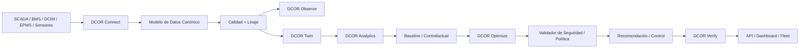

# DCOR — Optimización y Reducción de Data Centers

**[English](../../README.md) | [Português](README.pt-br.md) | Español | [Français](README.fr.md) | [日本語](README.ja.md) | [简体中文](README.zh.md)**

**Conectar. Medir. Simular. Optimizar. Verificar.**

DCOR es una plataforma neutral respecto de proveedores para optimizar energía, refrigeración, costes, carbono y operación de centros de datos.

> **SCADA muestra. DCIM organiza. BMS controla. DCOR explica, simula, optimiza y verifica.**

## Identidad

### Otto — mascota de DCOR


Otto es una nutria: representa el uso inteligente del agua, adaptación, eficiencia, observabilidad, refrigeración y resiliencia. **Otto observa antes de actuar, optimiza bajo restricciones y verifica el resultado.**

## Arquitectura



DCOR no sustituye SCADA, BMS, DCIM ni EPMS. Los datos entran mediante conectores, se normalizan a un contrato canónico y después llegan a analytics, twin, optimización y verificación.

## Estrategia multilenguaje

El código es **polyglot por frontera**. El lenguaje se selecciona según runtime, protocolo, memoria, latencia, determinismo y destino de despliegue.

| Capa | Preferido | Alternativas |
|---|---|---|
| Modelo canónico / dominio | Python | Go, Rust |
| Conectores | Python | Go, Rust |
| Edge / bajo consumo | Go | Rust, Python |
| Adaptador de alto rendimiento | Rust | Go, C/C++ |
| Integración industrial/legacy | C/C++ | Rust, Python |
| Ciencia / investigación | Python | Julia |
| Optimización / ML | Python | Julia, Rust/C++ |
| API | Python | Go, Rust |
| Web | TypeScript | JavaScript |
| Firmware | C/C++ / Rust | — |

No reescribimos Python funcional solo para aumentar el número de lenguajes. Se introduce otro lenguaje cuando existe una ventaja medible.

## Desarrollo

```sh
./scripts/bootstrap.sh
./scripts/test.sh
```

El gate local y el gate de CI utilizan el mismo camino de validación. La cobertura objetivo del paquete es **100%**.

## Roadmap S0–S11

`PLANNED → IN PROGRESS → CI VALIDATED → DONE`

S0 baseline/CI → S1 arquitectura/contratos → S2 Connector SDK → S3 Frontier → S4 NLR/DOE → S5 CSV/Parquet → S6 MQTT/REST → S7 Twin/Baseline → S8 optimización → S9 DQN/RL → S10 verificación/control → S11 SaaS/producción.

## Conectores y optimización

Orden de conectores: Frontier, NLR/DOE, CSV/Parquet, MQTT, REST y después adaptadores BMS/DCIM/SCADA/EPMS.

Secuencia de optimización: **baseline → reglas → PID/MPC/MILP → DQN → Double/Dueling DQN → PPO/SAC**.

El dashboard consume el contrato canónico; no es el punto de partida.

## Documentación

Consulta la [documentación principal en inglés](../../README.md) para el contrato completo, el monitor de entrega y la estructura del repositorio.

**Estado:** fundación S0/S1/S2 en progreso; S3 es el siguiente hito después de validar el gate.
