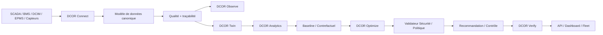

# DCOR — Optimisation et Réduction des Data Centers

**[English](../../README.md) | [Português](README.pt-br.md) | [Español](README.es.md) | Français | [日本語](README.ja.md) | [简体中文](README.zh.md)**

**Connecter. Mesurer. Simuler. Optimiser. Vérifier.**

DCOR est une plateforme indépendante des fournisseurs pour optimiser l’énergie, le refroidissement, les coûts, le carbone et les opérations des centres de données.

> **SCADA affiche. DCIM organise. BMS contrôle. DCOR explique, simule, optimise et vérifie.**

## Identité

### Otto — mascotte DCOR


Otto est une loutre : elle représente l’usage intelligent de l’eau, l’adaptation, l’efficacité, l’observabilité, le refroidissement et la résilience. **Otto observe avant d’agir, optimise sous contraintes et vérifie le résultat.**

## Architecture



DCOR ne remplace pas SCADA, BMS, DCIM ou EPMS. Les données passent par des connecteurs, sont normalisées selon un contrat canonique, puis alimentent le twin, l’analytics, l’optimisation et la vérification.

## Stratégie multilangage

Le code est **polyglotte par frontière**. Le langage dépend du runtime, du protocole, de la mémoire, de la latence, du déterminisme et de la cible de déploiement.

| Couche | Préféré | Alternatives |
|---|---|---|
| Modèle canonique / domaine | Python | Go, Rust |
| Connecteurs | Python | Go, Rust |
| Edge / faible consommation | Go | Rust, Python |
| Adaptateur haute performance | Rust | Go, C/C++ |
| Intégration industrielle/legacy | C/C++ | Rust, Python |
| Science / recherche | Python | Julia |
| Optimisation / ML | Python | Julia, Rust/C++ |
| API | Python | Go, Rust |
| Web | TypeScript | JavaScript |
| Firmware | C/C++ / Rust | — |

Un composant Python fonctionnel n’est pas réécrit uniquement pour augmenter le nombre de langages. Un autre langage doit apporter un avantage mesurable.

## Développement

```sh
./scripts/bootstrap.sh
./scripts/test.sh
```

Le gate local et le gate CI utilisent le même chemin de validation. La couverture cible du package est de **100 %**.

## Roadmap S0–S11

`PLANNED → IN PROGRESS → CI VALIDATED → DONE`

S0 baseline/CI → S1 architecture/contrats → S2 Connector SDK → S3 Frontier → S4 NLR/DOE → S5 CSV/Parquet → S6 MQTT/REST → S7 Twin/Baseline → S8 optimisation → S9 DQN/RL → S10 vérification/contrôle → S11 SaaS/production.

## Connecteurs et optimisation

Ordre prévu : Frontier, NLR/DOE, CSV/Parquet, MQTT, REST, puis les adaptateurs BMS/DCIM/SCADA/EPMS.

Séquence d’optimisation : **baseline → règles → PID/MPC/MILP → DQN → Double/Dueling DQN → PPO/SAC**.

Le dashboard consomme le contrat canonique ; il n’est pas le point de départ.

## Documentation

Consultez la [documentation principale en anglais](../../README.md) pour le contrat complet, le suivi de livraison et l’arborescence du dépôt.

**État :** fondation S0/S1/S2 en cours ; S3 est le prochain jalon après validation du gate.
