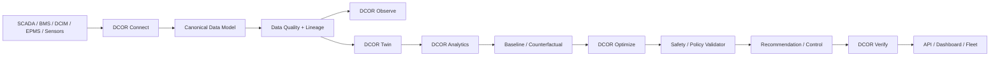

# DCOR — データセンター最適化・削減

**[English](../../README.md) | [Português](README.pt-br.md) | [Español](README.es.md) | [Français](README.fr.md) | 日本語 | [简体中文](README.zh.md)**

**接続する。測定する。シミュレーションする。最適化する。検証する。**

DCOR は、データセンターの電力、冷却、コスト、炭素排出、運用を最適化するベンダーニュートラルなプラットフォームです。

> **SCADA は表示する。DCIM は整理する。BMS は制御する。DCOR は説明し、シミュレーションし、最適化し、検証する。**

## プロジェクト・アイデンティティ

### Otto — DCOR マスコット


Otto はカワウソです。水の効率的な利用、適応性、可観測性、冷却、レジリエンスを表します。**Otto は行動する前に観測し、制約内で最適化し、結果を検証します。**

## アーキテクチャ



DCOR は SCADA、BMS、DCIM、EPMS を置き換えません。コネクタからデータを取り込み、カノニカル契約へ正規化してから twin、analytics、最適化、検証へ渡します。

## マルチ言語戦略

DCOR は **境界ごとの polyglot** を採用します。言語は理念ではなく、runtime、プロトコル、メモリ、レイテンシ、決定性、デプロイ先によって選択します。

| レイヤー | 推奨 | 代替 |
|---|---|---|
| Canonical model / domain | Python | Go, Rust |
| Connector | Python | Go, Rust |
| Edge / 低メモリ | Go | Rust, Python |
| 高性能 protocol adapter | Rust | Go, C/C++ |
| 産業 / legacy | C/C++ | Rust, Python |
| 科学 / research | Python | Julia |
| Optimization / ML | Python | Julia, Rust/C++ |
| API | Python | Go, Rust |
| Web | TypeScript | JavaScript |
| Firmware | C/C++ / Rust | — |

動作している Python を、言語数を増やすためだけに Go/Rust へ書き換えることはしません。別言語は測定可能な利点がある場合に導入します。

## 開発

```sh
./scripts/bootstrap.sh
./scripts/test.sh
```

ローカル gate と CI gate は同じ検証経路を使用します。パッケージのカバレッジ目標は **100%** です。

## ロードマップ S0–S11

`PLANNED → IN PROGRESS → CI VALIDATED → DONE`

S0 baseline/CI → S1 architecture/contracts → S2 Connector SDK → S3 Frontier → S4 NLR/DOE → S5 CSV/Parquet → S6 MQTT/REST → S7 Twin/Baseline → S8 optimization → S9 DQN/RL → S10 verification/control → S11 SaaS/production.

## Connector と Optimization

コネクタの優先順は Frontier、NLR/DOE、CSV/Parquet、MQTT、REST、その後 BMS/DCIM/SCADA/EPMS adapter です。

最適化は **baseline → rules → PID/MPC/MILP → DQN → Double/Dueling DQN → PPO/SAC** の順で評価します。

Dashboard は canonical contract の利用者であり、開発の出発点ではありません。

## ドキュメント

完全な技術仕様、delivery monitor、repository layout は[英語版 README](../../README.md)を参照してください。

**Status:** S0/S1/S2 foundation は進行中。gate の検証後、S3 が次のマイルストーンです。
