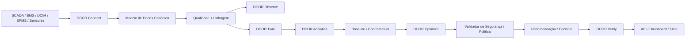

# DCOR — Otimização e Redução de Data Centers

**[English](../../README.md) | Português | [Español](README.es.md) | [Français](README.fr.md) | [日本語](README.ja.md) | [简体中文](README.zh.md)**

**Conectar. Medir. Simular. Otimizar. Verificar.**

DCOR é uma plataforma vendor-neutral para otimização de energia, refrigeração, custo, carbono e operação de data centers.

> **SCADA mostra. DCIM organiza. BMS controla. DCOR explica, simula, otimiza e verifica.**

## Identidade

### Otto — mascote do DCOR


Otto é uma lontra: representa uso inteligente de água, adaptação, eficiência, observabilidade, refrigeração e resiliência. **Otto observa antes de agir, otimiza sob restrições e verifica o resultado.**

## Arquitetura



DCOR não substitui SCADA, BMS, DCIM ou EPMS. Os dados entram por conectores, são normalizados para um contrato canônico e só então chegam a analytics, twin, otimização e verificação.

## Estratégia multilíngue

O código é **polyglot por fronteira**. A linguagem é escolhida pelo runtime, protocolo, memória, latência, determinismo e destino de implantação.

| Camada | Preferencial | Alternativas |
|---|---|---|
| Modelo canônico / domínio | Python | Go, Rust |
| Conectores | Python | Go, Rust |
| Edge / baixo consumo | Go | Rust, Python |
| Adapter de alto desempenho | Rust | Go, C/C++ |
| Legado industrial | C/C++ | Rust, Python |
| Ciência / pesquisa | Python | Julia |
| Otimização / ML | Python | Julia, Rust/C++ |
| API | Python | Go, Rust |
| Web | TypeScript | JavaScript |
| Firmware | C/C++ / Rust | — |

Não reescrevemos Python funcional apenas para aumentar a quantidade de linguagens. Outra linguagem entra quando existe ganho mensurável.

## Desenvolvimento

```sh
./scripts/bootstrap.sh
./scripts/test.sh
```

O gate local e o gate de CI usam o mesmo caminho de validação. A meta de cobertura do pacote é **100%**.

## Roadmap S0–S11

`PLANNED → IN PROGRESS → CI VALIDATED → DONE`

S0 baseline/CI → S1 arquitetura/contratos → S2 Connector SDK → S3 Frontier → S4 NLR/DOE → S5 CSV/Parquet → S6 MQTT/REST → S7 Twin/Baseline → S8 otimização → S9 DQN/RL → S10 verificação/controle → S11 SaaS/produção.

## Conectores

A ordem planejada é Frontier, NLR/DOE, CSV/Parquet, MQTT, REST e depois adapters adicionais de BMS/DCIM/SCADA/EPMS.

## Otimização

A sequência de engenharia é:

**baseline → regras → PID/MPC/MILP → DQN → Double/Dueling DQN → PPO/SAC**.

O dashboard é consumidor do contrato canônico; não é o ponto de partida.

## Documentação

- [Arquitetura](../../ARCHITECTURE.md)
- [Padrões](../../STANDARDS.md)
- [Backlog](../../BACKLOG.md)
- [Desenvolvimento](../DEVELOPMENT.md)
- [Compatibilidade](../COMPATIBILITY.md)
- [Manifesto de entrega](../DELIVERY_MANIFEST.md)

**Status:** fundação S0/S1/S2 em andamento; S3 é o próximo marco após a validação do gate.
