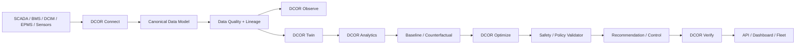

# DCOR — 数据中心优化与降耗

**[English](../../README.md) | [Português](README.pt-br.md) | [Español](README.es.md) | [Français](README.fr.md) | [日本語](README.ja.md) | 简体中文**

**连接。测量。仿真。优化。验证。**

DCOR 是一个厂商中立的数据中心平台，用于优化能源、制冷、成本、碳排放和运营。

> **SCADA 负责显示。DCIM 负责组织。BMS 负责控制。DCOR 负责解释、仿真、优化和验证。**

## 项目身份

### Otto — DCOR 吉祥物


Otto 是水獭，代表水资源的高效利用、适应性、可观测性、冷却、韧性与受控优化。**Otto 在行动前先观察，在约束条件下优化，并验证结果。**

## 架构



DCOR 不替代 SCADA、BMS、DCIM 或 EPMS。数据通过连接器进入，统一为规范化数据契约，然后进入 twin、analytics、优化和验证流程。

## 多语言工程策略

DCOR 按**边界采用多语言**。语言根据运行时、协议、内存、延迟、确定性和部署目标选择。

| 层 | 首选 | 可选 |
|---|---|---|
| Canonical model / domain | Python | Go, Rust |
| Connector | Python | Go, Rust |
| Edge / 低内存 | Go | Rust, Python |
| 高性能协议适配器 | Rust | Go, C/C++ |
| 工业 / legacy | C/C++ | Rust, Python |
| 科学 / research | Python | Julia |
| Optimization / ML | Python | Julia, Rust/C++ |
| API | Python | Go, Rust |
| Web | TypeScript | JavaScript |
| Firmware | C/C++ / Rust | — |

不会为了增加语言数量而重写已经稳定工作的 Python。只有在存在可测量收益时才引入其他语言。

## 开发

```sh
./scripts/bootstrap.sh
./scripts/test.sh
```

本地 gate 与 CI gate 使用相同的验证路径。软件包覆盖率目标为 **100%**。

## S0–S11 路线图

`PLANNED → IN PROGRESS → CI VALIDATED → DONE`

S0 baseline/CI → S1 architecture/contracts → S2 Connector SDK → S3 Frontier → S4 NLR/DOE → S5 CSV/Parquet → S6 MQTT/REST → S7 Twin/Baseline → S8 optimization → S9 DQN/RL → S10 verification/control → S11 SaaS/production。

## 连接器与优化

连接器顺序：Frontier、NLR/DOE、CSV/Parquet、MQTT、REST，然后扩展 BMS/DCIM/SCADA/EPMS 适配器。

优化顺序：**baseline → rules → PID/MPC/MILP → DQN → Double/Dueling DQN → PPO/SAC**。

Dashboard 只是规范化数据契约的消费者，不是开发起点。

## 文档

完整的技术契约、交付监控和仓库结构请参阅[英文 README](../../README.md)。

**状态：** S0/S1/S2 基础建设进行中；gate 验证完成后进入 S3。
